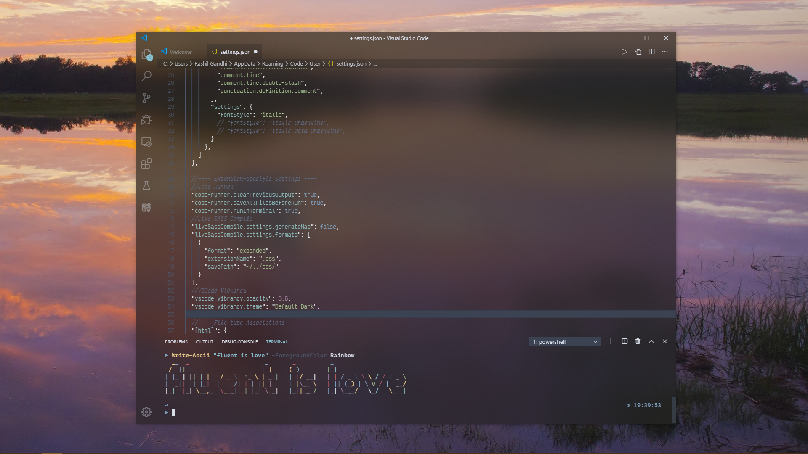
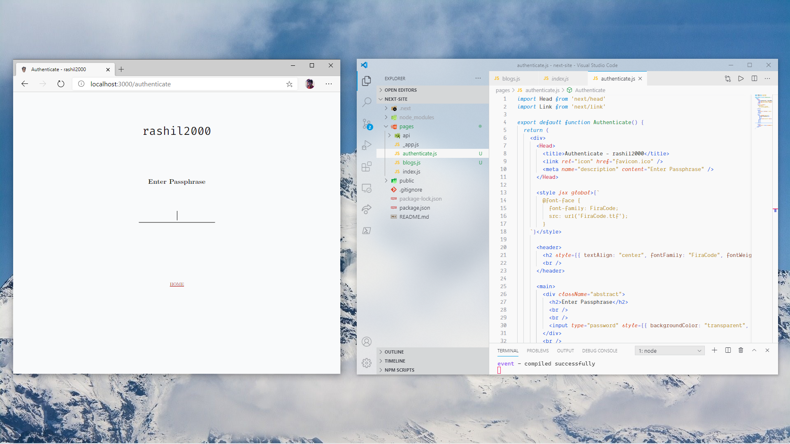
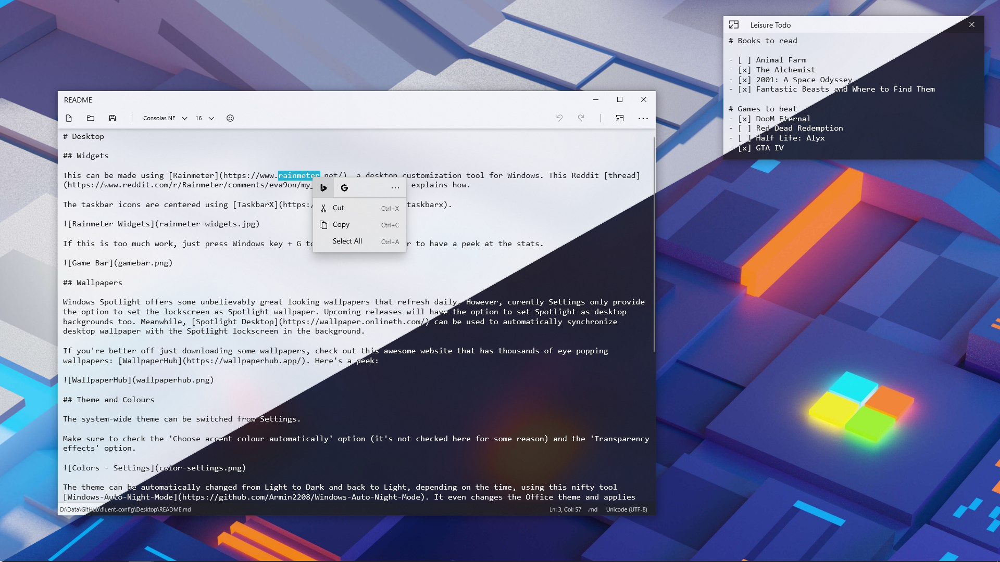
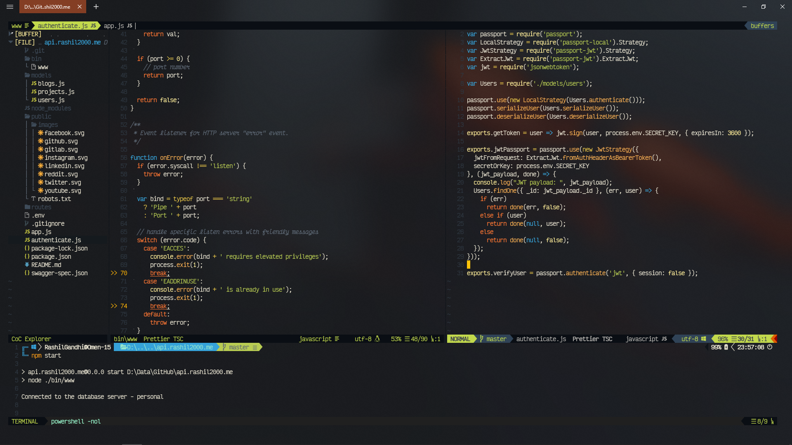

# Editors

## Visual Studio Code

[Visual Studio Code](https://code.visualstudio.com/) is by far the most popular code editor currently, and needs no introduction. Built as a lightweight alternative to Visual Studio itself, the editor can be fluent-ified very easily by using the extension [Vibrancy](https://marketplace.visualstudio.com/items?itemName=eyhn.vscode-vibrancy).

Here's how it looks:

The Vibrancy settings can be tweaked to blur only the sidebar too:

I've included the VSCode `settings.json` file here for inspiration.

## Quick Pad

Tired of the age-old Notepad? Give [Quick-Pad](https://github.com/yaichenbaum/Quick-Pad), a beautiful alternative to Notepad, a chance. Keeping fluent design in mind, Quick-Pad adds lots of quality-of-life improvements over the classic Notepad.

Here's a quick look in both light and dark themes:

Its Compact Overlay mode (top right in screenshot) can act as a nifty alternative to the default Sticky Notes app. My configuration file `Quick-Pad-Settings.json` is included here for reference.

## NeoVim

When it comes to commandline-based text editors, nothing in the world beats Vim. [NeoVim](https://neovim.io/) is a modern rewrite of Vim focused on extensibility and compatibility.

Vim philosophy is based on customization through plugins, and after spending a million hours on different configurations, I've finally settled on the plugin  configuration given in `init.vim` here. (For use in Vim, just rename this file to `.vimrc`.)

## Nano

[GNU Nano](https://www.nano-editor.org/) is a quick, super fast and no-nonsense commandline editor, and I use it for editing config files or looking up stuff in a jiffy. It's not extensible, but it supports colors and syntax highlighting for a few languages out-of-the-box. For supporting more language syntaxes, checkout the [nanorc](https://github.com/scopatz/nanorc) project.

My `.nanorc` file is also here if needed.
